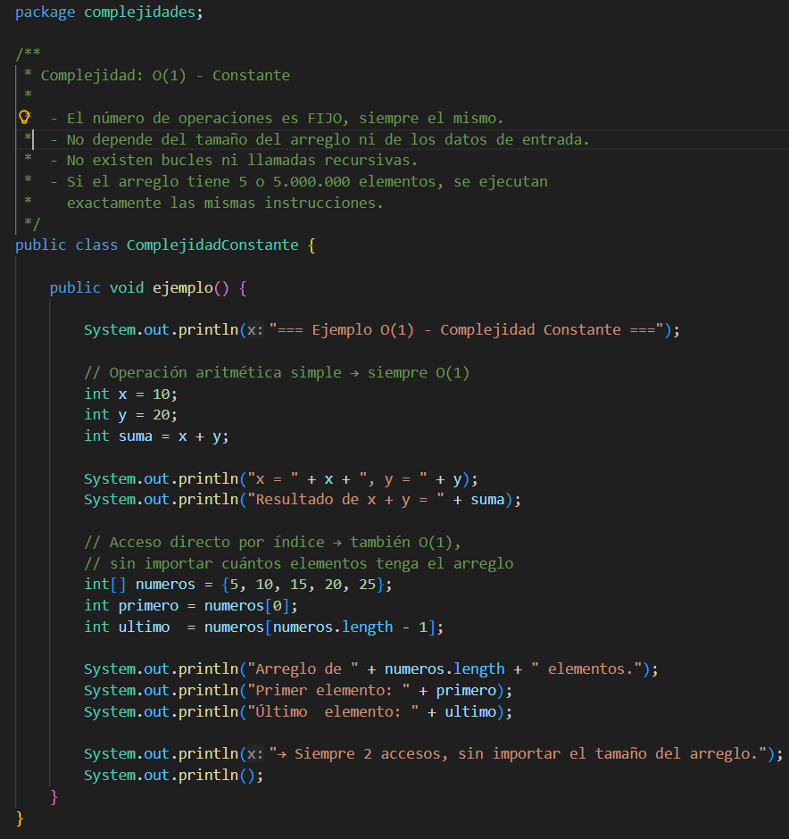
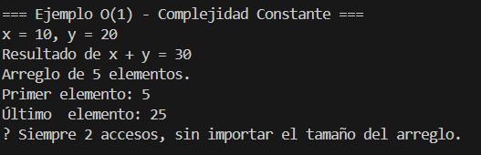
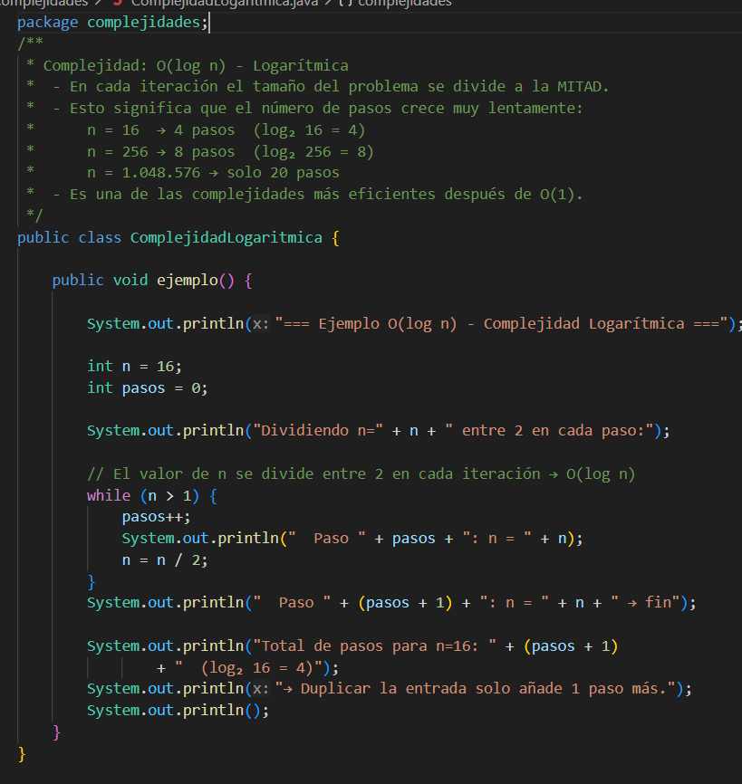
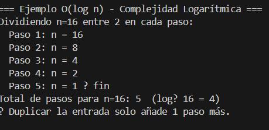
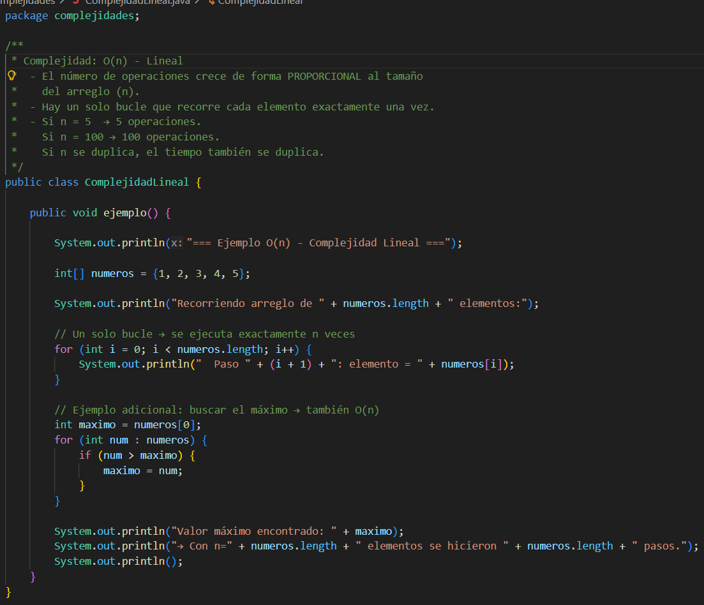
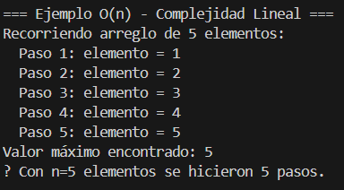
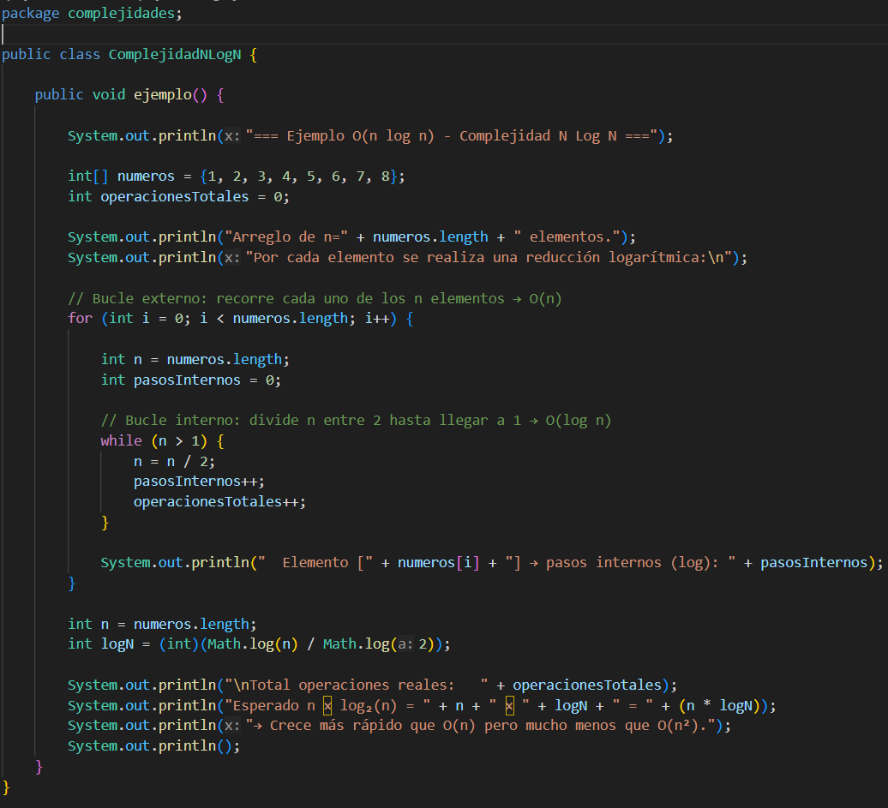
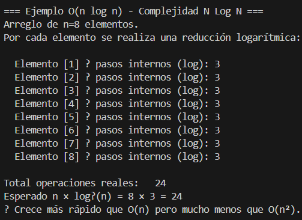
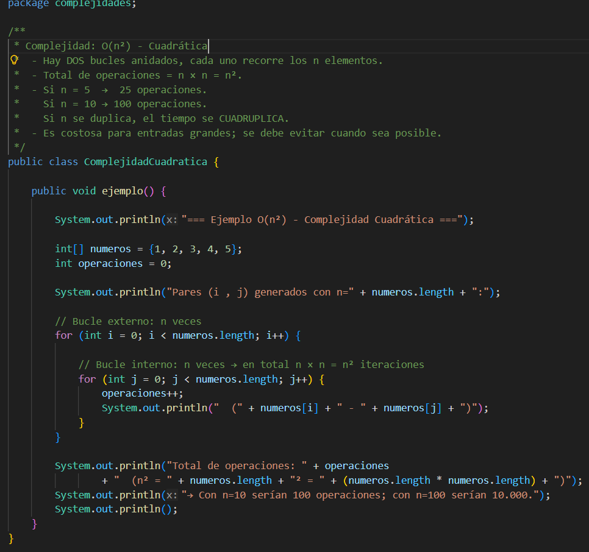
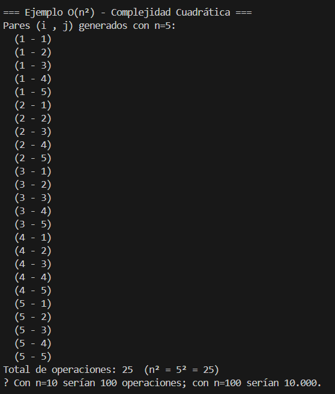

### Integrantes:

### Nathaly Jimenez, Evelyn Mayancela, Valeria Jimenez, Michelle Marca, Jose Carrion.
--------------------------------------------------------------------

# `Teoria de la Complejidad`
## 1. Teoría de la Complejidad – ¿Qué es?
La teoría de la complejidad estudia qué tan eficiente es un algoritmo en términos de: 
- Tiempo 
- Memoria 

Se usa para comparar algoritmos y elegir el mejor.

## 2. `¿Qué es un algoritmo y por qué es importante? `

 Un algoritmo es un conjunto de pasos ordenados y finitos que se siguen para resolver un problema o realizar una tarea. 

### `Ejemplo:` Hacer un sándwich:  Los pasos que seguimos son: 
1. Tomar el pan 
2. Poner jamón 
3. Poner queso 
4. Cerrar el pan 

 Eso ya es un algoritmo. 

### Importancia:  

Permite resolver problemas de forma clara y organizada es la base de la programación, la cual tambien ayuda a automatizar tareas, haciendo posible que las computadoras funcionen correctamente 
 
## 3.¿Qué significa que un algoritmo sea eficiente? 

  Un algoritmo es eficiente cuando logra resolver un problema: 
  ● Usando menos tiempo (CPU) 
  ● Usando menos memoria (RAM) 
### `Es decir, hace el mismo trabajo pero de manera más rápida y con menos recursos. 
  Ejemplo: 
  Buscar un número en una lista: 
  ●  Método lento: revisar uno por uno 
  ●  Método eficiente: usar búsqueda binaria (divide la lista en partes) 

## 4.Eficiencia de algoritmos
---------------------------------------------------
## Coste temporal y coste espacial 
Coste temporal (tiempo) 
Es el tiempo que tarda un algoritmo en ejecutarse. Ejemplo: 
● Recorrer una lista de 10 elementos → rápido.
● Recorrer una lista de 1 millón → más lento.
Mientras más operaciones haga, más tiempo tarda. 
## Coste espacial (memoria) 
Es la cantidad de memoria que utiliza el algoritmo. 
Ejemplo: 
● Guardar 10 números → poca memoria 
● Guardar 1 millón → mucha memoria 4.
---------------------------------------------------------
 
## 5. Factores de tiempo de ejecución 
● Factores propios 
● Factores circunstanciales 
● Análisis teórico 
● Análisis experimental

## ¿Que’ es un factor de tiempo de ejecución?

El tiempo de ejecución es la fase del ciclo de vida de un programa durante la cual un procesador o máquina virtual, ejecuta el código después de compilarlo o interpretarlo. Durante esta fase, el programa realiza las operaciones previstas: responde a las entradas, gestiona la memoria, gestiona las excepciones e interactúa con los recursos del sistema.
El entorno de ejecución proporciona la infraestructura necesaria para respaldar estas actividades, incluidos servicios como administración de memoria, recolección de elementos no utilizados, subprocesos y entrada, salida.
----------------------------------------------------

## Factores propios:

Los factores propios son aquellos que dependen directamente del diseño y estructura del algoritmo.  Estos incluyen la cantidad de pasos que sigue, el tipo de estructuras que utiliza y la lógica que utiliza para resolver el problema. Estos factores son importantes porque determinan la eficiencia interna del algoritmo.

### `Ejemplo:`
Un algoritmo que utiliza dos ciclos (uno dentro de otro) realizará muchas más operaciones que uno que solo tiene un ciclo simple, por lo que su tiempo de ejecución será mayor.
Un solo ciclo (menos operaciones)

for (int i = 0; i < n; i++){  
  System.out.println(i); }
Dos ciclos anidados (más operaciones)
for (int i = 0; i < n; i++) {
    for (int j = 0; j < n; j++) {
        System.out.println(i + " " + j);}  }

La segunda por tener dos bucles repite más veces y por lo tanto se demora mas.

## Factores circunstanciales:

Los factores circunstanciales son aquellos que dependen del entorno en el que se ejecuta el algoritmo. Estos incluyen el tipo de computadora, la velocidad del procesador, la memoria disponible y el lenguaje de programación utilizado.

### `Ejemplo:`
Un mismo algoritmo puede ejecutarse más rápido en una computadora moderna que en una más antigua, aunque el programa sea exactamente el mismo.
for (int i = 0; i < 1000000; i++) {
    System.out.println(i); }

Dependiendo la computadora donde se ejecute el código se estima el tiempo, si es una moderna el tiempo es mas corto que una que es más antigua.
-------------------------------------------------------------
## Análisis teórico:

El análisis teórico consiste en estudiar el comportamiento de un algoritmo sin necesidad de ejecutarlo. Se basa en analizar el número de operaciones que realiza en función del tamaño de los datos de entrada, lo que permite estimar su rendimiento de forma general.

### `Ejemplo:`
Se puede analizar cuántas veces se repite un proceso dependiendo del tamaño de los datos, por ejemplo, si un algoritmo repite una operación tantas veces como elementos tenga una lista.

for (int i = 0; i < n; i++) {
    System.out.println(i); }

Sin ejecutarlo sabemos:
Se repite n veces, entonces el tiempo depende de n.
-----------------------------------------------------------
## Análisis experimental:
El análisis experimental consiste en evaluar el rendimiento de un algoritmo mediante su ejecución real. Para ello, se realizan pruebas con diferentes tamaños de datos y se mide el tiempo que tarda en completarse.

### `Ejemplo:`
Se puede ejecutar un programa con listas pequeñas y luego con listas más grandes, comparando cuánto tiempo tarda en cada caso para observar cómo cambia su rendimiento.

long inicio = System.currentTimeMillis();
for (int i = 0; i < n; i++) {
    System.out.println(i); }
long fin = System.currentTimeMillis();
System.out.println("Tiempo: " + (fin - inicio) + " ms");

Experimentamos con el código y verificamos cuanto tarda en ejecutarse.
----------------------------------------------------------------
## ¿Qué es Big O? 
Es una notación matemática que describe cómo crece el número de operaciones de un algoritmo cuando el tamaño de los datos de entrada (n) aumenta, no mide segundos exactos, sino el comportamiento en el peor de los casos. 
Big O ignora constantes y detalles pequeños, solo analiza qué tan rápido crece el problema.
## Mejor caso: 
Es el escenario más favorable para el algoritmo. La entrada está en la condición ideal.
## `Ejemplo:` 
Buscar un número en una lista y que esté en la primera posición. Solo necesitas 1 comparación → O(1), O(log n)

## Peor caso: 
    Es el escenario más desfavorable. La entrada obliga al algoritmo a hacer el máximo trabajo posible. O(n^2)

## Caso Promedio: 
Es el comportamiento esperado en condiciones normales, promediando todos los posibles escenarios.
### `Ejemplo:`
 Buscar un número que en promedio está a la mitad de la lista → O(n/2) que simplificamos como O(n)
- Cada una de las notaciones O(n), O (log n), etc:
### 1. Constante - O(1): 
Sin importar si el arreglo tiene 10 o 10 millones de elementos, 
    el algoritmo siempre ejecuta exactamente la misma cantidad de operaciones. No hay bucles, no hay recorridos, es acceso directo.
### 2. Lineal - O(n): 
El algoritmo divide el problema a la mitad en cada paso. Esto significa que, aunque los datos crezcan exponencialmente, el trabajo crece muy poco. Si se tiene 1,000 elementos se necesita uno 10 pasos; si tiene 1,000,000 elementos necesitan solo 20 pasos.
### 3. Logarítmica - O (n log n):
 El número de operaciones crece exactamente igual que los datos. Si duplica los datos, el tiempo se duplica. Si tiene 100 elementos hace 100 operaciones; con 1,000 hace 1,000.
### 4. Cuadrática - O(n^2): 
Generalmente aparece cuando tiene un bucle dentro de otro bucle, y cada uno recorre los n datos. Si duplica los datos, el tiempo se cuadruplica. Con 10 elementos son 100 operaciones; con 100 elementos son 10,000.
### 5. Exponencial - O(2^n): 
Cada elemento nuevo duplica el número de operaciones. Para n=10 son 1,024 operaciones. Para n=50 son más de 1,000 billones. Completamente impráctico para valores medianos de n.
### 6. Factorial - O(n!): 
El peor crecimiento posible. Para n = 10 son 3,628,800 operaciones; para n = 20 son más de 2,400 billones. En la práctica, este tipo de algoritmos solo son viables para entradas de tamaño n menor a 12 o 15.

------------------------------------


# Complejidad O(1) - Constante

### Nombre del archivo: ComplejidadConstante.java

La complejidad constante significa que el algoritmo realiza siempre el mismo número fijo de operaciones, sin importar cuán grande sea la entrada. No existe ningún bucle ni recursión que dependa de n.

## Codigo:


## Salida de Consola:


# Complejidad O(log n) -Logaritmica

### Nombre del archivo: ComplejidadLogaritmica.java

La complejidad logarítmica ocurre cuando el tamaño del problema se divide a la mitad en cada paso. Crece muy lentamente: con n = 1.000.000 solo se necesitan aproximadamente 20 pasos.

## Codigo:

## Salida de Consola:


# Complejidad O(n) -Lineal

### Nombre del archivo: ComplejidadLineal.java

La complejidad lineal ocurre cuando el número de operaciones crece de forma proporcional al tamaño de la entrada. Si n se duplica, el tiempo también se duplica.

## Codigo:


## Salida de Consola:



# Complejidad O(n log n) --Lineal-Logaritmica

### Nombre del archivo: ComplejidadNlogN.java
Combina un recorrido lineal con una operación logarítmica dentro de él. Es la complejidad de los algoritmos de ordenamiento más eficientes como Merge Sort y Quick Sort.

## Codigo:

## Salida de Consola:



# Complejidad O(n²) -- Cuadrática

### Nombre del archivo: ComplejidadCuadratica.java

La complejidad cuadrática ocurre cuando hay dos bucles anidados, cada uno dependiente de n. El tiempo crece de forma cuadrática: si n se duplica, el tiempo se cuadruplica.

## Codigo:


## Salida de Consola:



# Conclusiones — Práctica 4.1: Teoría de la Complejidad


---


### 1. ¿Qué complejidad es más costosa y por qué?

La complejidad más costosa es **O(n!)** — factorial — seguida de **O(2ⁿ)** — exponencial. Al implementar y analizar los ejemplos en Java, comprendimos por qué estas notaciones son prácticamente inviables: con apenas 20 elementos de entrada, O(n!) supera los 2,400 billones de operaciones, un número que ningún procesador actual puede manejar en tiempo razonable.

Lo que el código nos dejó muy claro es la escala comparativa:

```
O(1) → O(log n) → O(n) → O(n log n) → O(n²) → O(2ⁿ) → O(n!)
 más eficiente ————————————————————————————————> más costosa
```

Incluso O(n²), que parece moderada, se vuelve problemática rápidamente: con 1,000 elementos realiza 1,000,000 de operaciones, mientras que O(n) con los mismos datos solo realiza 1,000. La diferencia es visible directamente en el código al comparar `ComplejidadLineal.java` con `ComplejidadCuadratica.java`.

---

### 2. ¿Qué aprendieron del análisis?

El desarrollo del proyecto nos enseñó que **analizar un algoritmo va mucho más allá de verificar que funcione correctamente**. Un programa puede entregar el resultado esperado y al mismo tiempo ser completamente ineficiente para datos del mundo real.

Aprendimos a distinguir dos dimensiones clave de la eficiencia:

- **Coste temporal**: cuántas operaciones ejecuta el algoritmo en función del tamaño de entrada.
- **Coste espacial**: cuánta memoria consume durante su ejecución.

También aprendimos que existen tres escenarios de análisis —mejor caso, peor caso y caso promedio— y que Big O siempre describe el peor escenario, lo cual es lo más útil al diseñar software real, porque nos prepara para las condiciones más exigentes.

Finalmente, la diferencia entre **análisis teórico** y **análisis experimental** quedó muy clara al escribir el código: teóricamente sabemos que un bucle anidado es O(n²), pero al medirlo con `System.currentTimeMillis()` pudimos ver ese crecimiento reflejado en números reales.

---

### 3. ¿Qué les sorprendió más al ver el código?

Lo que más nos sorprendió fue **lo inocente que puede verse un código costoso**. Al escribir `ComplejidadCuadratica.java`, el código con dos bucles anidados ocupa apenas unas pocas líneas y parece simple, pero su impacto en rendimiento con datos grandes es enorme.

También nos sorprendió la eficiencia de la búsqueda binaria — O(log n) —: mientras que recorrer una lista de un millón de elementos uno por uno requiere un millón de pasos, la búsqueda binaria necesita aproximadamente solo 20. Ver eso implementado en `ComplejidadLogaritmica.java` hace que el concepto deje de ser abstracto y se vuelva completamente concreto.

Otro punto que llamó nuestra atención fue que **el mismo algoritmo puede tener distintos casos de complejidad según los datos de entrada**, algo que solo queda claro cuando se experimenta directamente con código.

---

### 4. Reflexión final del grupo

Esta práctica nos demostró que la Teoría de la Complejidad no es un tema exclusivamente académico: es una herramienta de toma de decisiones que todo desarrollador necesita. Al crear cada clase Java y justificar su complejidad, pasamos de memorizar definiciones a realmente entender por qué un algoritmo se comporta de cierta manera.

El ejercicio de documentar cada clase en el README también nos exigió un nivel de comprensión más profundo, porque no bastaba con que el código funcionara — teníamos que ser capaces de explicar **por qué** ese código era O(n), O(n²) o O(log n). Esa conexión entre teoría y práctica es, creemos, el aprendizaje más valioso de esta práctica.

Como conclusión general: **un buen programador no solo escribe código que funciona, sino código que escala**.

---